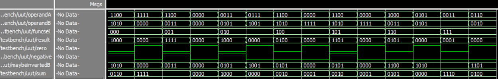
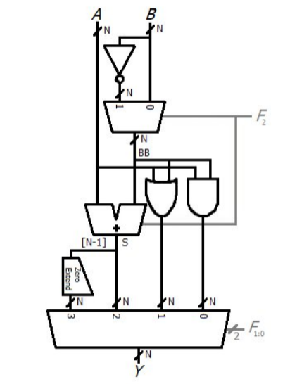
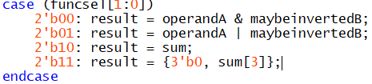
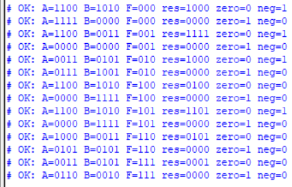

# Лабораторная работа №5 Арифметико-логическое устройство

- [Testbench](Untitled-1.sv)
- [Lab5](lab5.sv) - код
- [Task](schem_lab_5_2026.pdf)

**Участники:**

- Кутенков Андрей Алексеевич
- Нгуен Зуй-Ань Куеевич

**Группа:** 2 (чётная)

## Результат

<p align="center">
    
</p>

## Задание 

1. Спроектируйте на языке SystemVerilog АЛУ, показанное на схеме,
приведенной на рисунке 1. 

<p align="center">
    
</p>

Закончите строки со знаками вопроса:

<p align="center">
    
</p>

2. Напишите на языке System Verilog модуль, тестирующий работу АЛУ
(тестбенч). Модуль сам должен сигнализировать о наличии ошибок в работе АЛУ.

<p align="center">
    
</p>

```systemverilog
task check_output;
        if (result !== expected_result || zero !== expected_zero || negative !== expected_negative) begin
            $error("Time=%0t A=%b B=%b F=%b Exp: res=%b zero=%b neg=%b Got: res=%b zero=%b neg=%b", 
                   $time, operandA, operandB, funcsel, expected_result, expected_zero, expected_negative, result, zero, negative);
            errors = errors + 1;
        end else begin
            $display("OK: A=%b B=%b F=%b res=%b zero=%b neg=%b", 
                    operandA, operandB, funcsel, result, zero, negative);
        end
    endtask
```

3. Добавьте в схему АЛУ дополнительный одноразрядный выход zero,
который устанавливается в единицу, если все разряды N-разрядного выхода
равны 0.

```systemverilog
assign zero = (result == 4'b0000);
```

4. Дополните тестбенч новыми тесткейсами, чтобы протестировать
доработанную схему АЛУ.

```systemverilog
operandA = 4'b1111; operandB = 4'b0000; funcsel = 3'b000; #10;
expected_result = 4'b0000;
expected_zero = 1;  
expected_negative = 0;
check_output();

operandA = 4'b1100; operandB = 4'b1010; funcsel = 3'b000; #10;
expected_result = 4'b1000;
expected_zero = 0;  
expected_negative = 1;
check_output();
```

5. Добавьте в схему АЛУ дополнительный одноразрядный выход Negative,
который устанавливается в единицу, если результат меньше нуля.

```systemverilog
assign negative = result[3];
```

6. Дополните тестенч так, чтобы протестировать доработанную схему

```systemverilog

operandA = 4'b1100; operandB = 4'b1010; funcsel = 3'b000; #10;
expected_result = 4'b1000;
expected_zero = 0;
expected_negative = 1; 
check_output();

operandA = 4'b1100; operandB = 4'b1010; funcsel = 3'b100; #10;
expected_result = 4'b0100;
expected_zero = 0;
expected_negative = 0;  
check_output();

operandA = 4'b1111; operandB = 4'b0000; funcsel = 3'b000; #10;
expected_result = 4'b0000;
expected_zero = 1;
expected_negative = 0; 
check_output();
```