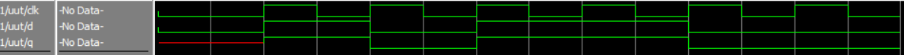
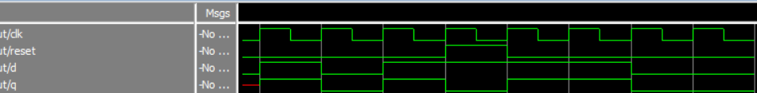
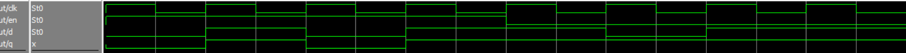
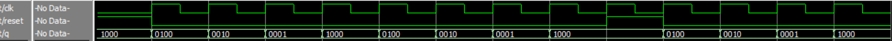
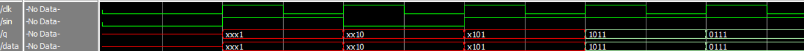

# Лабораторная работа №6 Триггеры и регистры

- Testbench:
  - [testbench1](testbench1.sv)
  - [testbench2](testbench2.sv)
  - [testbench3](testbench3.sv)
  - [testbench4](testbench4.sv)
  - [testbench5](testbench5.sv)
- [Lab6](lab6.sv) - код
- [Task](schem_lab_6_2026.pdf)

**Участники:**

- Кутенков Андрей Алексеевич
- Нгуен Зуй-Ань Куеевич

**Группа:** 2 (чётная)

## Результат

[**testbench1**](testbench1.sv)

<p align="center">
    
</p>

[**testbench2**](testbench2.sv)

<p align="center">
    
</p>

[**testbench3**](testbench3.sv)

<p align="center">
    
</p>

[**testbench4**](testbench4.sv)

<p align="center">
    
</p>

[**testbench5**](testbench5.sv)

<p align="center">
    
</p>

---

## Задание 

**Задание 1:**
  1. Спроектируйте на языке SystemVerilog триггер, синхронизируемый по
фронту.
  2. Загрузите в плату, проверьте работоспособность. Объясните принцип
работы.
  3. Напишите тест, отладьте разработанную схему в симуляторе

**Задание 2:**
  1. Спроектируйте на языке SystemVerilog триггер с синхронным сбросом. Объясните получившуюся схему.
  2. Загрузите в плату, проверьте работоспособность. Объясните принцип работы.
  3. Напишите тест, отладьте разработанную схему в симуляторе
   
**Задание 3:**
  1. Спроектируйте на языке SystemVerilog триггер с разрешающим входом.
  2. Загрузите в плату, проверьте работоспособность. Объясните принципы работы.
  3. Напишите тест, отладьте разработанную схему в симуляторе
   
**Задание 4:**
  1. Спроектируйте на языке SystemVerilog распределитель импульсов по схеме,приведённой на рисунке 10.
  2. Напишите тест, отладьте разработанную схему в симуляторе.
   
**Задание 5:**
  1. Спроектируйте на языке SystemVerilg четырёхразрядный сдвиговый регистр (по вариантам). Для этого модифицируйте код параллельного регистра. Для перераспределения битов можно использовать следующую конструкцию: 
   ```systemverilog
   {data[2:0], 1'b0}.
   ```

**1** вариант (нечётный номер бригады) – параллельно-последовательный

**2** вариант (нечётный номер бригады) - параллельно-последовательный

**Наш вариант - 2 **

Напишите тест, отладьте разработанную схему в симуляторе