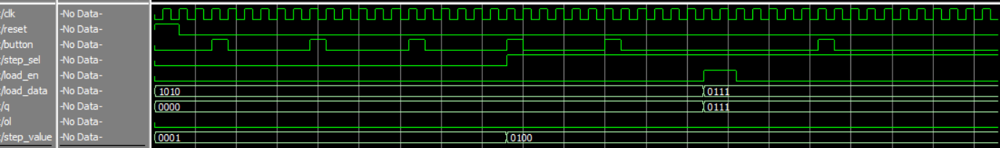
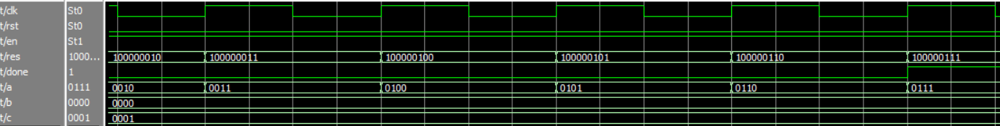
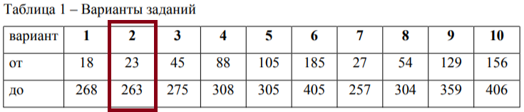

# Лабораторная работа №7 Счётчики

- Testbench:
  - [testbench1-3](testbench1-3.sv)
  - [testbench4-5](testbench2.sv)
- [Lab7_1-3](lab7.sv) - код  1-3 лабы
- [Lab7_4-5](lab7_4_5.sv) - код 4-5 лабы
- [Task](schem_lab_7_2026.pdf)

**Участники:**

- Кутенков Андрей Алексеевич
- Нгуен Зуй-Ань Куеевич

**Группа:** 2 (чётная)

## Результат

[**testbench1-3**](testbench1-3.sv)

    

[**testbench4-5**](testbench4-5.sv)

    

---

## Задание 

**Задание 1:**

1. Спроектируйте на языке SystemVerilog четырёхразрядный суммирующий
счётчик. Для устранения дребезга кнопки подключите к ней модуль
antitinkling (листинг 1).
2. Загрузите в плату, проверьте работоспособность.
3. Напишите тест, отладьте разработанную схему в симуляторе

**Задание 2:**

1. Модифицируйте счётчик так, чтобы он по каждому фронту тактового
импульса увеличивал своё значение на 4.
2. Загрузите в плату, проверьте работоспособность.
3. Напишите тест, отладьте разработанную схему в симуляторе

**Задание 3:**

1. Добавьте к счётчику из задания 1 входы data_load для загрузки данных и вход
load для разрешения установки значения.
2. Напишите тест, отладьте разработанную схему в симуляторе

**Задание 4:**

1. Используя несколько модулей четырёхразрядных счётчиков, спроектируйте
счётчик, считающий от заданного начального числа, до заданного конечного
(см. таблицу 1). В дополнение можно использовать любые уже известные
комбинационные схемы. Схема может также иметь дополнительные входы,
например вход разрешения счёта, входы загрузки.
2. Напишите тест, отладьте разработанную схему в симуляторе.

**Задание 5*:**

1. * Модифицируйте схему из пункта 5 так, чтобы в ней использовалось два
четырёхразрядных модуля счётчиков.
2. Напишите тест, отладьте разработанную схему в симуляторе.

    

